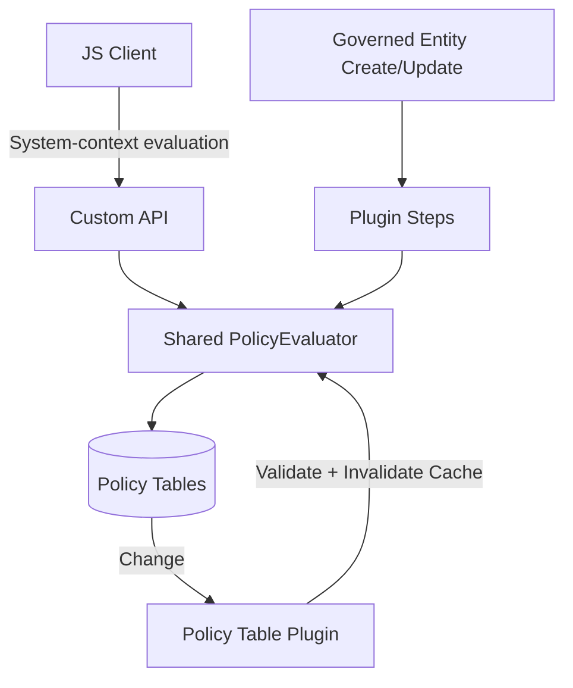

# Dataverse Policy Engine – Roadmap

This roadmap preserves v1 stability while incrementally adding capability.

---

# v2.1 – Expanded Operators

Add support for:

- GreaterThan
- GreaterOrEqual
- LessThan
- LessOrEqual
- Contains (string)
- StartsWith (string)
- Changed (Update-only; requires PreImage)

---

# v2.2 – Cross-Attribute Comparison

Enhance Policy Condition with:

- CompareTo (Constant | AnotherAttribute)
- CompareAttributeLogicalName (text)

Allows rules such as:

"If EndDate < StartDate → NotAllowed"

---

# v2.3 – OR Condition Groups

Add:

- ConditionGroup (whole number)

Evaluation logic:

- OR across groups
- AND within each group

Example:

(Group 1: A AND B)  
OR  
(Group 2: C AND D)

---

# v2.4 – Multiple Target Attributes Per Rule

Introduce:

## Policy Target (Child of Policy Rule)

Columns:
- PolicyRule (lookup)
- TargetAttributeLogicalName (text)
- Sequence

Allows one condition set to control multiple attributes without duplicating rules.

---

# v2.5 – Custom API Contract Hardening (Client Uses System Context)

Formalize Custom API shape and responses:

EvaluatePolicies(
- entityLogicalName
- recordId (optional)
- changedAttributes (optional)
- currentValues (optional; if needed for create)
)

Returns effective decisions for:
- Visible
- Required
- NotAllowed

Notes:
- Client always calls Custom API (system context)
- JS never needs direct read access to policy tables
- Plugin never calls Custom API over HTTP; plugin calls evaluator in-process

---

# v2.6 – Diagnostics & Explain Mode

Enhance evaluation engine to optionally return:

- Matched Rule IDs
- Condition evaluation trace (which condition failed)
- Effective decision per PolicyType
- “Why not?” output for admins

Useful for:
- Admin troubleshooting
- Debug UI
- Logging

---

# v2.7 – Performance & Caching

- Cache active rules per entity + attribute + policy type
- Cache conditions grouped by rule
- Invalidate cache when PolicyRule/PolicyCondition changes (policy-table plugin)
- Reduce plugin query overhead

---

# v2.8 – Context-Based Policies

Add optional rule filters:

- AppliesOn (Create | Update | Both)
- Execution Stage (PreOperation | PostOperation)
- User Role filter
- Business Unit filter
- Team filter

---

# v2.9 – Policy Authoring & Validation UX

- Custom Page or PCF authoring experience
- Attribute picker from metadata
- Operator/type/value validation on save
- “Test against record” experience (admin tool)
- Optional publish/activate flow

---

# Long-Term Vision

- Full metadata-driven rule engine
- Centralized evaluation engine reused by Custom API + Plugins
- Policy “explainability” as a first-class feature
- Enterprise-grade extensibility framework

---

# Guiding Principles

- Keep v1 deterministic
- Add complexity only when needed
- Preserve backward compatibility
- Prefer configuration over schema expansion
- Keep enforcement centralized in plugin layer

---

# Architecture Evolution Diagram

