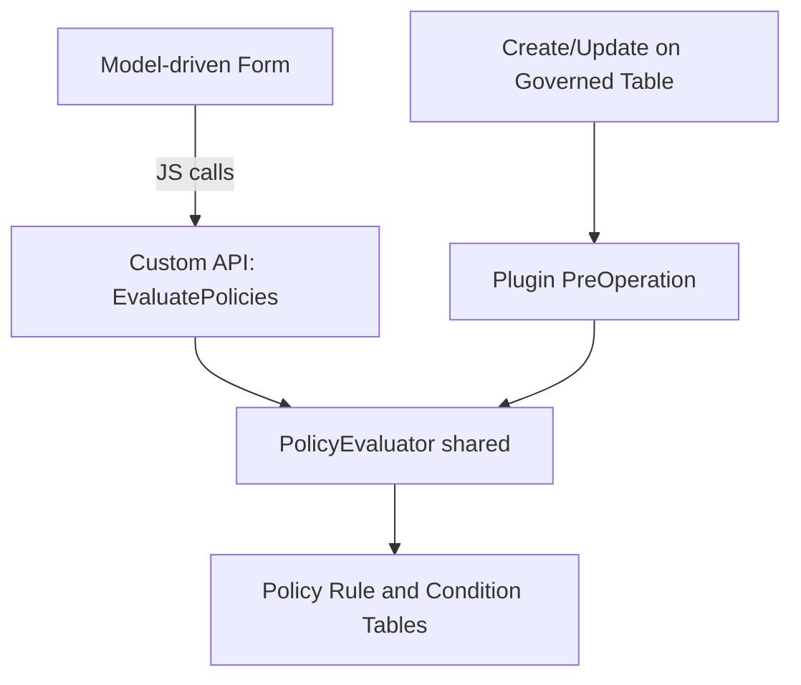
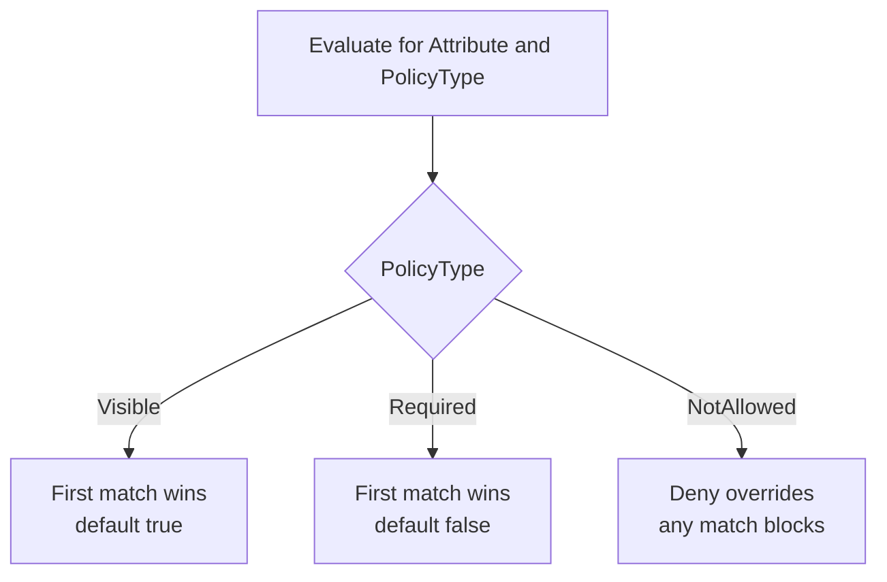

# Dataverse Policy Engine – Architecture (v1)

Version: 1.0  
Last Updated: 2026-02-13  
Status: Stable (v1)

---

# Purpose

Provide dynamic, configurable attribute-level policies in Dataverse that control:

- Visibility
- Required state
- Edit restrictions (Not Allowed)

Policies are enforced:
- Client-side (JavaScript) for user experience
- Server-side (Plugin) for authoritative enforcement

Client-side evaluation must run in **system context**, so the client calls a **Custom API** (rather than reading policy tables directly).

---

# Core Design Decisions

## Policy Types

PolicyType (single select choice):

- Visible
- Required
- NotAllowed

### Defaults

- Visible = true
- Required = false
- NotAllowed = false (Allowed by default)

### Evaluation Strategy

- Visible → First matching rule wins
- Required → First matching rule wins
- NotAllowed → Deny overrides (any matching rule blocks)

---

# Data Model

## 1) Policy Rule (Header)

Represents:
- What attribute is being controlled
- What type of policy applies

### Columns

- TargetEntityLogicalName (text)
- TargetAttributeLogicalName (text)
- PolicyType (choice: Visible / Required / NotAllowed)
- Result (boolean)
- Sequence (whole number)
- IsActive (yes/no)

### Notes

- Lower Sequence number = higher priority
- Only one PolicyType per rule
- Deterministic evaluation order

---

## 2) Policy Condition (Child of Policy Rule)

Represents:
- When the rule applies

### Columns

- PolicyRule (lookup)
- Sequence (whole number)
- Operator (choice):
  - Equals
  - NotEquals
  - IsNull
  - IsNotNull

- ValueType (choice):
  - String
  - Number
  - Boolean
  - OptionSet
  - Lookup

### Typed Value Columns

- ValueString (text)
- ValueNumber (decimal)
- ValueBoolean (yes/no)
- ValueOptionSetValue (whole number)
- ValueLookupLogicalName (text)
- ValueLookupId (uniqueidentifier)

### Condition Logic

- All conditions under a rule are AND
- Evaluated in Sequence order
- Rule matches only if all conditions evaluate true

---

# Lookup Comparison Strategy

Lookup constants are stored as:

- ValueLookupLogicalName (text)
- ValueLookupId (guid)

This avoids creating polymorphic lookup relationships and allows comparison against any table.

Comparison logic:
- EntityReference.LogicalName == ValueLookupLogicalName
- EntityReference.Id == ValueLookupId

---

# Evaluation Model

## Evaluation Steps

1. Load Policy Rules where:
   - TargetEntityLogicalName matches entity
   - TargetAttributeLogicalName matches attribute
   - IsActive = true

2. Sort by PolicyRule.Sequence ascending

3. For each rule:
   - Evaluate all Policy Conditions (AND)
   - If match → apply policy logic for that PolicyType

---

## Visible

- First matching rule wins
- Apply rule.Result
- Stop evaluating
- If none match → Visible = true

---

## Required

- First matching rule wins
- Apply rule.Result
- Stop evaluating
- If none match → Required = false

---

## NotAllowed

- Deny overrides
- If any matching rule has Result = true → NotAllowed = true
- Stop immediately
- If none match → NotAllowed = false

---

# Enforcement & Execution Architecture

This solution intentionally uses **one shared evaluation engine** used by both:
- the Custom API (for form/client decisions)
- the Plugin (for database enforcement)

Important: the Plugin does NOT call the Custom API over HTTP/Web API.  
Both entry points call the same in-process library/class (shared evaluator code).

## Components

- PolicyEvaluator (shared C# code)
  - Loads rules/conditions
  - Evaluates for Visible/Required/NotAllowed
  - Returns effective decisions (and optionally diagnostics later)

- Custom API: EvaluatePolicies
  - Runs in system context (so client doesn't need read access to policy tables)
  - Used by JavaScript to apply UI changes (visible/required/disabled)

- Plugin on governed tables
  - Registered on Create/Update (PreOperation)
  - Calls PolicyEvaluator directly
  - Enforces NotAllowed and Required by throwing exceptions

- Plugin on policy tables (Policy Rule / Policy Condition)
  - Used only for:
    - validating configuration (operator/type/value sanity)
    - cache invalidation (if/when caching is added)
  - Not used for enforcing business data changes

---

# Runtime Flows

## A) Model-driven Form (JavaScript)

- JS detects changes to trigger fields
- JS calls Custom API EvaluatePolicies
- Custom API returns effective decisions
- JS applies:
  - Visible → setVisible
  - Required → setRequiredLevel
  - NotAllowed → disable control

## B) Server Enforcement (Plugin on governed entity)

On Create/Update (PreOperation):
- Determine affected attributes (Target keys)
- Evaluate NotAllowed + Required via PolicyEvaluator
- Enforce:

### NotAllowed Enforcement

On Update:
- If attribute present in Target and NotAllowed = true:
  - Compare Target value vs PreImage value
  - If different → throw InvalidPluginExecutionException

On Create:
- If attribute set and NotAllowed = true → throw exception

### Required Enforcement

On Create:
- If Required = true and attribute null → throw

On Update:
- If attribute being set to null and Required = true → throw

---

# Architecture Diagrams

## High-level: one evaluator, two entry points

## Enforcement decision behavior

---

# Limitations (v1)
- Operators limited to Equals, NotEquals, IsNull, IsNotNull
- AND-only conditions
- One PolicyType per rule
- No OR groups
- No cross-attribute comparison
- No role/user-based context filtering
- Custom API returns decisions, not full explain traces (yet)
This version is intentionally minimal and deterministic.

# Design Philosophy

- Deterministic rule evaluation (Sequence)
- Minimal schema complexity
- Strong server-side enforcement
- System-context evaluation for UI via Custom API
- Avoid relationship explosion for lookup constants
- Secure by default (deny-overrides via NotAllowed)

---
