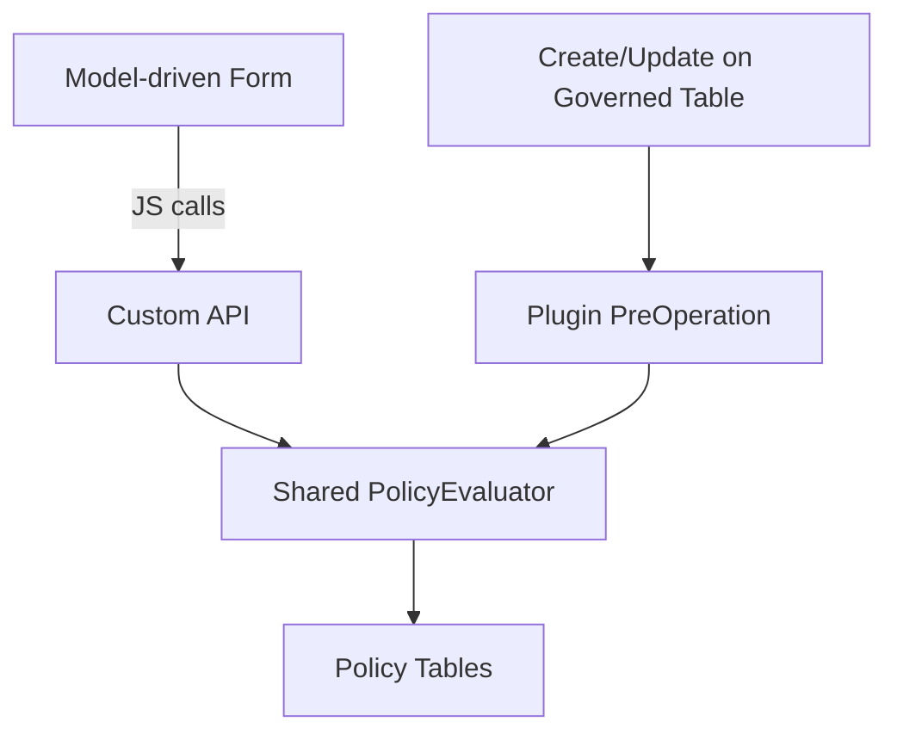

# Dataverse Policy Engine – Architecture Documentation

This directory contains the formal architecture documentation for the Dataverse Policy Engine solution.

The documentation is versioned alongside the source code and reflects architectural decisions, constraints, and planned evolution.

---

# Current Stable Architecture

## Policy Engine v1

📄 See: `PolicyEngine-v1.md`

Defines:

- Core data model (Policy Rule + Policy Condition)
- Evaluation strategy
- Enforcement model (Plugin + Custom API)
- Default behaviors
- Deterministic sequencing
- System-context client evaluation
- Lookup comparison strategy
- Known limitations

This document represents the stable baseline implementation.

---

# Roadmap & Evolution

## Policy Engine Roadmap

📄 See: `PolicyEngine-roadmap.md`

Defines:

- Future operator expansion
- Cross-attribute comparisons
- OR condition groups
- Multi-target rules
- Custom API contract formalization
- Diagnostics / explain mode
- Caching strategy
- Context-based rules (role/BU/team)
- Long-term extensibility vision

This document outlines planned incremental capability expansion while preserving v1 stability.

---

# Architectural Principles

The Policy Engine is built on the following principles:

- Deterministic rule evaluation
- Secure by default (deny overrides)
- Centralized enforcement logic
- Shared evaluation engine across:
  - Custom API (system-context client evaluation)
  - Plugin enforcement (database layer)
- Minimal schema complexity
- Extensibility without breaking v1 contracts

---

# Runtime Overview

High-level system architecture:

